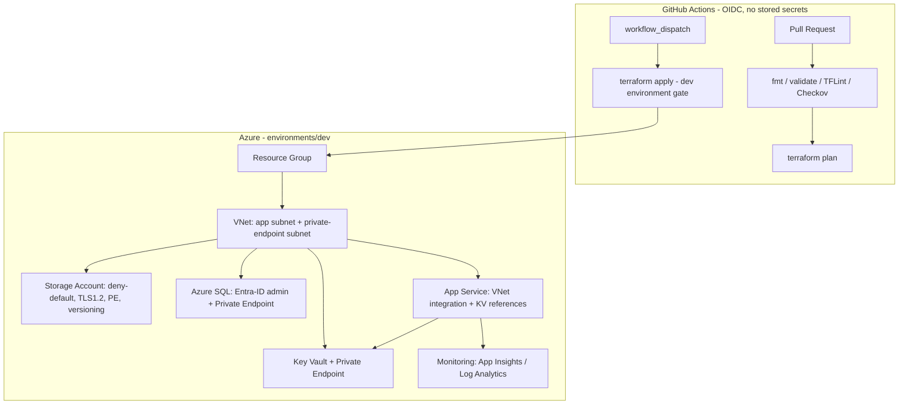

# terraform-azure-infra

Modular, security-hardened Azure platform provisioned with Terraform. Private networking throughout, remote state with locking, and an OIDC-authenticated CI/CD pipeline with format, validation, lint, and security scanning gates.

> Everything below is provisioned as reusable modules composed in `environments/dev`. No secrets are stored in the repo or the pipeline — CI authenticates to Azure via OIDC federated credentials.

## Architecture



## Modules

| Module | Provisions | Security posture |
|---|---|---|
| `resource-group` | Resource group + tagging | Consistent tags, `managedby = terraform` |
| `network` | VNet, app subnet, private-endpoint subnet | Segmented subnets for app vs private endpoints |
| `monitoring` | Application Insights / Log Analytics | Central telemetry for App Service |
| `key-vault` | Key Vault + Private Endpoint | Private DNS, deployer-scoped access, IP allowlist |
| `storage-account` | Storage account + Private Endpoint | `default_action = Deny`, TLS 1.2, no public blobs, blob versioning + 7-day retention, private DNS zone |
| `sql-database` | Azure SQL server + database | Entra-ID (AAD) admin, Private Endpoint, no SQL-auth admin |
| `app-service` | Linux App Service | VNet integration, Key Vault references (no secrets in app settings), App Insights wired in |

Composition, naming, and tagging live in `environments/dev/main.tf`; a random suffix keeps globally-unique names (Storage, Key Vault, SQL) collision-free.

## Security highlights (what an interviewer will look for)

- **Private networking by default** — Key Vault, Storage, and SQL are reached over Private Endpoints with private DNS zones; public network access is denied or IP-allowlisted.
- **No secrets in code or pipeline** — App Service uses Key Vault references; CI uses OIDC federated identity (`ARM_USE_OIDC = true`), so there are no client secrets in GitHub.
- **Identity-based data plane** — SQL uses an Entra-ID administrator rather than SQL auth.
- **Hardened storage** — deny-by-default network rules, TLS 1.2 minimum, public blobs disabled, versioning + soft-delete retention.
- **State safety** — remote state in Azure Blob with automatic lease-based locking to prevent concurrent applies.

## CI/CD pipeline (`.github/workflows/terraform.yml`)

Authenticates to Azure with **OIDC** (`permissions: id-token: write`) — no stored credentials.

| Stage | Runs on | What it does |
|---|---|---|
| `validate` | every PR + push | `terraform fmt -check`, `init -backend=false`, `validate`, **TFLint**, **Checkov** security scan (`soft_fail: false`) |
| `check-azure` | every run | Skips plan/apply gracefully if Azure secrets aren't configured (validation still runs) |
| `plan` | PR / push to main | OIDC login → `init` with `backend.hcl` → `terraform plan` |
| `apply` | `workflow_dispatch` only | OIDC login → `terraform apply` behind the `dev` environment gate |

Plans run automatically on PRs; applies are manual and environment-gated — so no commit can silently mutate infrastructure.

## Remote state

State is stored in Azure Blob Storage with automatic locking.

| Setting | Value |
|---|---|
| Backend | `azurerm` |
| Container | `tfstate` |
| Locking | Automatic (Azure Blob lease) |
| Backend config | `environments/dev/backend.hcl` |

## Usage

```bash
cd environments/dev
cp terraform.tfvars.example terraform.tfvars   # set project, location, address spaces, allowed IPs
terraform init -backend-config=backend.hcl
terraform plan
terraform apply
```

Requirements: Terraform >= 1.9, Azure CLI (`az login`), an Azure subscription. For CI, configure an App Registration with a federated credential and set `AZURE_CLIENT_ID` / `AZURE_TENANT_ID` / `AZURE_SUBSCRIPTION_ID` as repo secrets.

## Tech

Terraform 1.9 · azurerm ~> 4.x · GitHub Actions (OIDC) · TFLint · Checkov · Azure: VNet, Private Endpoints, Private DNS, Key Vault, Storage, Azure SQL, App Service, App Insights.

## Certifications

Microsoft Azure Administrator Associate (AZ-104) · Azure Fundamentals (AZ-900)
