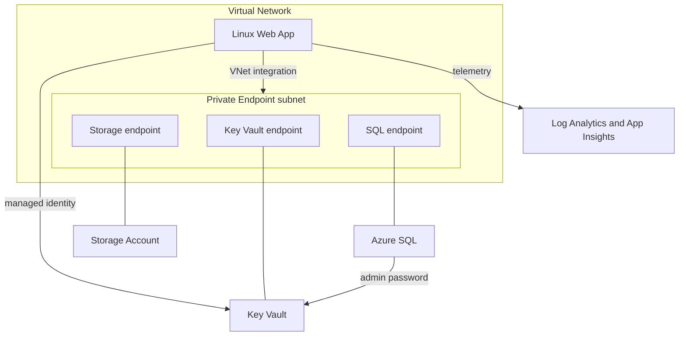

# Terraform Azure Infrastructure


Infrastructure-as-Code for a **secure, private web-application platform on Azure**, built with Terraform. Reusable modules, per-environment deployments, remote state, and a CI/CD pipeline that validates and security-scans every change before it reaches Azure.

The design goal is a network-isolated stack with **no public data-plane exposure**: the web app, database, secrets, and storage are reachable only from inside the virtual network via private endpoints. This mirrors infrastructure used in regulated industries such as healthcare, finance, and government, where sensitive data cannot traverse the public internet.

## Architecture



Every private endpoint has its own private DNS zone and VNet link, so in-network name resolution points at private IPs.

## What it deploys

- **Resource Group** and **Virtual Network** with a delegated subnet for App Service integration and an NSG-protected subnet for private endpoints.
- **Linux Web App** with system-assigned managed identity, HTTPS-only, TLS 1.2, HTTP/2, health checks, HTTP logging, regional VNet integration, public access disabled and fronted by a private endpoint.
- **Azure SQL** with public network access disabled, Azure AD administrator, TLS 1.2, and a private endpoint. The generated admin password is written directly to Key Vault, never exposed as an output.
- **Key Vault** that is RBAC-authorized, purge-protected, public access denied, reached over a private endpoint. The web app identity is granted Key Vault Secrets User.
- **Storage Account** with shared-key access disabled, public access off, TLS 1.2, blob versioning and soft delete, and a private endpoint.
- **Monitoring** via a Log Analytics workspace and workspace-based Application Insights.

## Repository structure

```text
modules/        resource-group, network, monitoring, key-vault,
                sql-database, app-service, storage-account
environments/   dev  (Basic / B1)   and   prod  (S0 / P1v3)
                same modules, sizing differs only in terraform.tfvars
bootstrap/      one-time creation of the remote-state storage account
.github/        CI pipeline: fmt, validate, tflint, checkov, plan, apply
```

## CI/CD

Every pull request and push runs `terraform fmt`, `validate`, TFLint, and Checkov, a security scan that fails the build on findings with documented risk-accepted exceptions in `.checkov.yaml`. The plan job runs against dev and apply runs on merge to main, both authenticating to Azure via OIDC federation with no stored secrets. The deploy jobs skip automatically until Azure credentials are configured.

## Usage

```bash
# 1. one-time: create the remote-state backend
cd bootstrap
terraform init && terraform apply

# 2. deploy an environment
cd ../environments/dev
cp backend.hcl.example backend.hcl
terraform init -backend-config=backend.hcl
terraform plan
terraform apply

# tear down when finished
terraform destroy
```

Dev uses the cheapest viable SKUs (SQL Basic, App Service B1). Run `terraform destroy` when not actively demoing.

## Concepts demonstrated

Reusable modules with clean input and output contracts, environment separation, remote state with locking, private endpoints and private DNS, managed identities and RBAC, secret management in Key Vault, secretless OIDC CI/CD, and policy-as-code security scanning with documented exceptions.

## Certifications

- Microsoft Azure Administrator Associate (AZ-104)
- Microsoft Azure Fundamentals (AZ-900)
